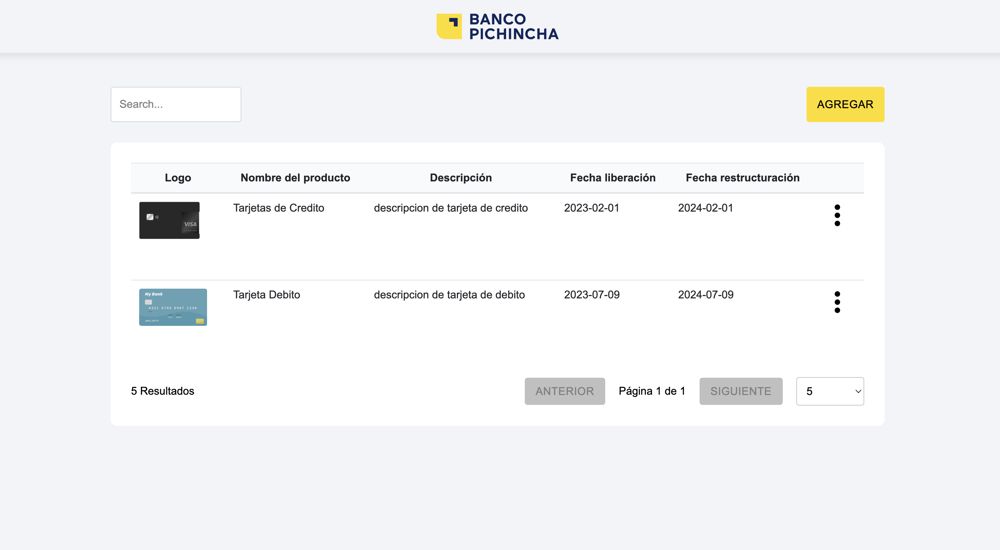

# Banco del Pichincha


Este proyecto es una aplicación web desarrollada en React y TypeScript, diseñada para los Oficiales de Cuenta del Banco del Pichincha. Permite visualizar, crear, editar y eliminar los diferentes productos financieros ofrecidos por la institución.

## Características
-Visualización de todos los productos financieros disponibles.
-Creación de nuevos productos financieros.
-Edición de productos financieros existentes.
-Eliminación de productos financieros.
-Desarrollada con React y TypeScript para garantizar un código robusto y predecible.
-Diseño responsivo y centrado en el usuario.

## Instale todas las dependencias necesarias
```
npm install
```

### Inicie el servidor de desarrollo local
```
npm run dev
```